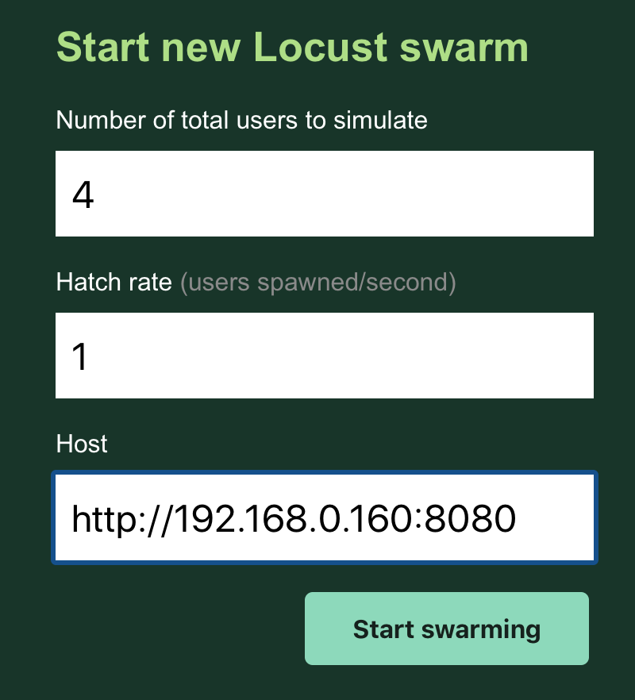
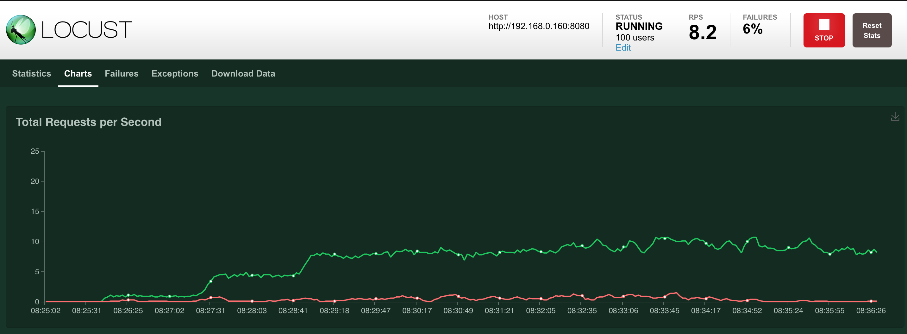
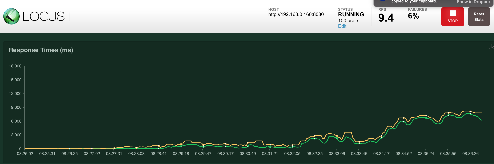
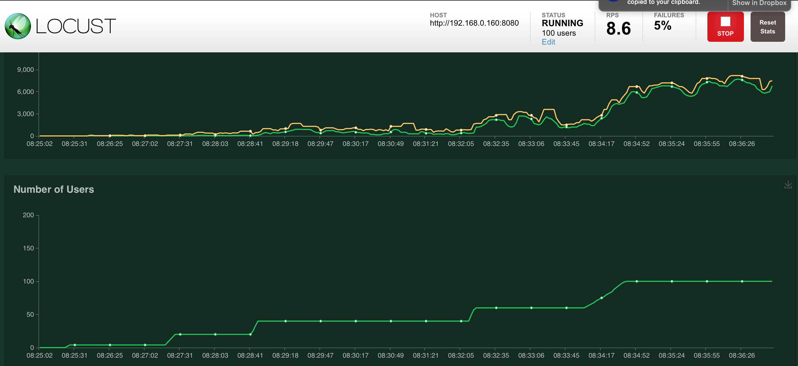
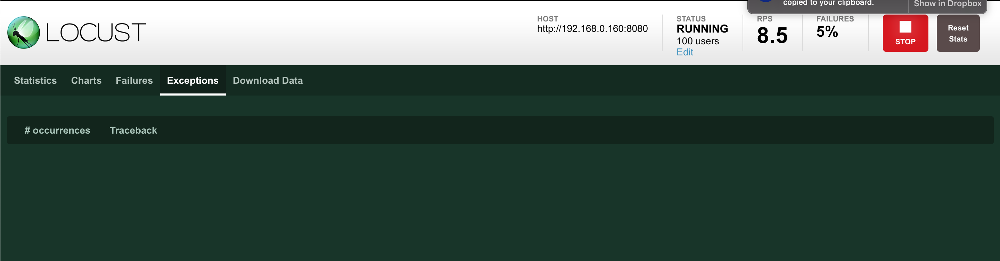
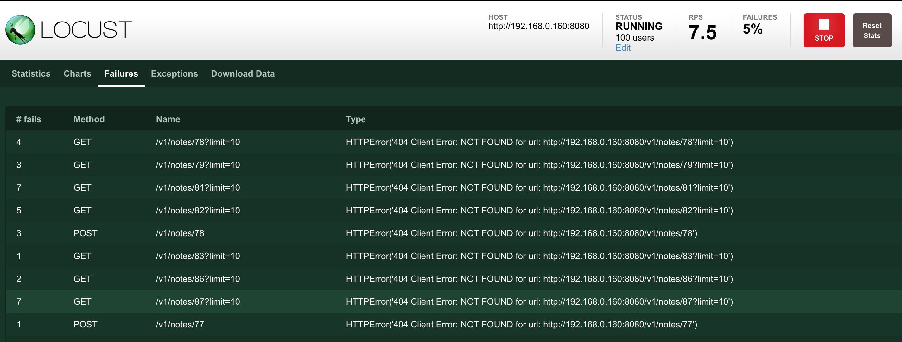

- [1. Objectives of the Scenario](#1-objectives-of-the-scenario)
- [2. Technology & Patterns](#2-technology--patterns)
- [3. Step-by-Step Demo Walk Through](#3-step-by-step-demo-walk-through)
  - [3.1. Manually investigating behaviour - Application Starting without a Database Server](#31-manually-investigating-behaviour---application-starting-without-a-database-server)
  - [3.2. Manually investigating behaviour - Application Starting with Intermittent Database Connectivity Working](#32-manually-investigating-behaviour---application-starting-with-intermittent-database-connectivity-working)
  - [3.3. Setting up a test under load - Introducing `locust`](#33-setting-up-a-test-under-load---introducing-locust)
  - [3.4. Conclusion from findings in the initial tests](#34-conclusion-from-findings-in-the-initial-tests)
  - [3.4 Introduce the circuit breaker](#34-introduce-the-circuit-breaker)
- [4. Scenario Discussion](#4-scenario-discussion)
  - [4.1 Trail-Map Progress](#41-trail-map-progress)
  - [4.2 Cloud-Native Principles Progress](#42-cloud-native-principles-progress)
- [5. References](#5-references)

# 1. Objectives of the Scenario

The objective of this scenario is more focused around the source code and more specifically refactoring around the `Circuit Breaker` patterns in order to cater for several scenarios within the `microservices` context that may see our application handling requests with some issue on the database (either it's still starting up, or there is some maintenance happening, making it unavailable).

# 2. Technology & Patterns

The primary pattern that will be implemented in this scenario is the [The Circuit Breaker Pattern](https://martinfowler.com/bliki/CircuitBreaker.html).

By extensive use of unit tests, various scenarios will be simulated where the database is unavailable.

# 3. Step-by-Step Demo Walk Through

The initial steps will be testing the original (current) behaviour based on version 0.0.2 of the application, after which we will be testing version 0.0.3 with the circuit breaker.

## 3.1. Manually investigating behaviour - Application Starting without a Database Server

For this part, ensure you have an image built of version 0.0.2. In my case, there happened to be an a version 0.0.2 in the private registry with the label 10:

```bash
$ curl http://192.168.0.160:5000/v2/_catalog
{"repositories":["cool-app","cool-app-base","cool-app-db"]}
$ curl http://192.168.0.160:5000/v2/cool-app/tags/list
{"name":"cool-app","tags":["8","6","latest","10","7"]}
```

First, I will cleanup all my local Docker images of `coolapp`:

```bash
$ docker image ls --all | grep cool
192.168.0.160:5000/cool-app-db      latest               5703dd254a34        46 hours ago        366MB
cool-app-db                         latest               5703dd254a34        46 hours ago        366MB
192.168.0.160:5000/cool-app         9                    637f96292fde        6 days ago          524MB
$ docker image rm 637f96292fde
Untagged: 192.168.0.160:5000/cool-app:9
Untagged: 192.168.0.160:5000/cool-app@sha256:6e2a2eefeea08702c61199aa36be8890ec09ff7738575970c6cb16f31f66ec3c
Deleted: sha256:637f96292fde095488d974a55c0cd9633dbe31c507270909631492d98349a64d
  .
  .
```

Now, pull the latest version of version 0.0.2:

```bash
$ docker pull 192.168.0.160:5000/cool-app:10
```

And now run it pointing to a non existing database server:

```
$ docker run --name coolapp-rest-service \
--network=coolapp-net \
-p 0.0.0.0:8080:8080 \
-m 512M --memory-swap 512M \
--cpu-quota 25000 \
-e SWAGGER_UI=1 \
-e LOG_LEVEL=DEBUG \
-d 192.168.0.160:5000/cool-app:10 
$ docker container ls
CONTAINER ID        IMAGE                                 COMMAND                  CREATED             STATUS              PORTS                                                                                                      NAMES
edf4aff57dd6        192.168.0.160:5000/cool-app:10        "gunicorn -w 1 -b 0.…"   17 seconds ago      Up 14 seconds       0.0.0.0:8080->8080/tcp                                                                                     coolapp-rest-service
6e888bfd4148        gcr.io/k8s-minikube/kicbase:v0.0.10   "/usr/local/bin/entr…"   41 hours ago        Up 41 hours         127.0.0.1:32823->22/tcp, 127.0.0.1:32822->2376/tcp, 127.0.0.1:32821->5000/tcp, 127.0.0.1:32820->8443/tcp   minikube
0bb4e346b8a8        registry:2                            "/entrypoint.sh /etc…"   6 days ago          Up 6 days           0.0.0.0:5000->5000/tcp                                                                                     registry
6ad45f581299        jenkins-custom                        "/sbin/tini -- /usr/…"   7 days ago          Up 7 days           0.0.0.0:50000->50000/tcp, 0.0.0.0:8085->8080/tcp                                                           jenkins-coolapp-builder
28cc7d0dbb52        postgres                              "docker-entrypoint.s…"   7 days ago          Up 7 days           0.0.0.0:5332->5432/tcp
$ docker logs coolapp-rest-service
[2020-05-17 07:38:45 +0000] [1] [INFO] Starting gunicorn 20.0.4
[2020-05-17 07:38:45 +0000] [1] [INFO] Listening at: http://0.0.0.0:8080 (1)
[2020-05-17 07:38:45 +0000] [1] [INFO] Using worker: sync
[2020-05-17 07:38:45 +0000] [9] [INFO] Booting worker with pid: 9

--==>  2020-05-17 07:38:56,971 - INFO - [None] [service_app.py:34:<module>] Reading OpenAPI from file "/opt"
```

So let's make a request and see what happens:

```
$ curl -vvv -X GET "http://192.168.0.160:8080/v1/user-profiles/search?email_address=user1%40example.tld" -H  "accept: application/json"
Note: Unnecessary use of -X or --request, GET is already inferred.
*   Trying 192.168.0.160...
* TCP_NODELAY set
* Connected to 192.168.0.160 (192.168.0.160) port 8080 (#0)
> GET /v1/user-profiles/search?email_address=user1%40example.tld HTTP/1.1
> Host: 192.168.0.160:8080
> User-Agent: curl/7.58.0
> accept: application/json
>
< HTTP/1.1 404 NOT FOUND
< Server: gunicorn/20.0.4
< Date: Sun, 17 May 2020 07:41:29 GMT
< Connection: close
< Content-Type: application/json
< Content-Length: 67
<
{
  "ErrorCode": 404,
  "ErrorMessage": "User Profile Not Found"
}
* Closing connection 0
```

You can view the logs again - there should be a rather log printout of the exception trace:


```bash
$ docker logs coolapp-rest-service
   .
   .
   .
--==>  2020-05-17 07:41:29,524 - ERROR - [None] [user_profiles.py:91:load_user_profile_by_email_address] EXCEPTION: Traceback (most recent call last):
  File "/usr/local/lib/python3.6/dist-packages/sqlalchemy/engine/base.py", line 2285, in _wrap_pool_connect
    return fn()
   .
   .
   .
psycopg2.OperationalError: could not translate host name "coolapp-db" to address: No address associated with hostname


The above exception was the direct cause of the following exception:

Traceback (most recent call last):
  File "/usr/local/lib/python3.6/dist-packages/cool_app/persistence/user_profiles.py", line 78, in load_user_profile_by_email_address
    with engine.connect() as connection:
   .
   .
   .
sqlalchemy.exc.OperationalError: (psycopg2.OperationalError) could not translate host name "coolapp-db" to address: No address associated with hostname

(Background on this error at: http://sqlalche.me/e/e3q8)


192.168.0.160 - - [17/May/2020:07:41:29 +0000] "GET /v1/user-profiles/search?email_address=user1%40example.tld HTTP/1.1" 404 67 "-" "curl/7.58.0"
```

Cleanup the test:

```
$ docker container stop coolapp-rest-service
coolapp-rest-service
$ docker container rm coolapp-rest-service
coolapp-rest-service
```

## 3.2. Manually investigating behaviour - Application Starting with Intermittent Database Connectivity Working

All examples below was run on the `Server`.

For this test, still on version 0.0.2, we will test the application working with a running database server. But, after a working request, we will stop the database server and run the request again. Finally we will start the database server and run the exact same test again to see if the application recovers. 

Since the application is controlled through `gunicorn` which starts several threads (4 in total), we will run each requests 10 times to ensure we have hit all the threads.

Start the application and DB server

```bash
$ $ docker run --name coolapp-db \
> --network=coolapp-net \
> -p 127.0.0.1:5432:5432 \
> -m 512M --memory-swap 512M \
> --cpu-quota 25000 \
> -e POSTGRES_PASSWORD=mysecretpassword \
> -d postgres
d1c56f750880891c230305926b08d45b79a4b2ed421b7bc1ee6d5286166ac73e
```

Give it a minute or so for PostgreSQL to initialise properly. Now create create the application database and tables:

```bash
$ docker run -it --rm --network coolapp-net postgres psql -h coolapp-db -U postgres
Password for user postgres:
psql (12.2 (Debian 12.2-2.pgdg100+1))
Type "help" for help.

postgres=# create database coolapp;
CREATE DATABASE
postgres=# \q

$ docker run -it --rm --network coolapp-net postgres psql -h coolapp-db -U postgres coolapp
Password for user postgres:
psql (12.2 (Debian 12.2-2.pgdg100+1))
Type "help" for help.

coolapp=# CREATE TABLE public.user_profiles (
coolapp(#     uid bigserial NOT NULL,
coolapp(#     user_alias varchar(64) NOT NULL,
coolapp(#     user_email_address varchar(255) NOT NULL,
coolapp(#     account_status int4 NOT NULL DEFAULT 1,
coolapp(#     CONSTRAINT user_profiles_pk PRIMARY KEY (uid),
coolapp(#     CONSTRAINT user_profiles_un_001 UNIQUE (user_email_address)
coolapp(# );
CREATE TABLE
coolapp=# CREATE TABLE public.notes (
coolapp(#     nid bigserial NOT NULL,
coolapp(#     uid int4 NOT NULL DEFAULT 1,
coolapp(#     note_timestamp int4 NOT NULL,
coolapp(#     note_text text NOT NULL,
coolapp(#     CONSTRAINT notes_pk PRIMARY KEY (nid),
coolapp(#     CONSTRAINT notes_un_01 UNIQUE (uid, note_timestamp),
coolapp(#     CONSTRAINT notes_un_02 UNIQUE (uid, note_text),
coolapp(#     CONSTRAINT notes_fk FOREIGN KEY (uid) REFERENCES user_profiles(uid) ON UPDATE RESTRICT ON DELETE RESTRICT
coolapp(# );
CREATE TABLE
coolapp=# \d
                  List of relations
 Schema |         Name          |   Type   |  Owner
--------+-----------------------+----------+----------
 public | notes                 | table    | postgres
 public | notes_nid_seq         | sequence | postgres
 public | user_profiles         | table    | postgres
 public | user_profiles_uid_seq | sequence | postgres
(4 rows)

coolapp=# \q
```

Start the application:

```bash
docker run --name coolapp-rest-service \
--network=coolapp-net \
-p 0.0.0.0:8080:8080 \
-m 512M --memory-swap 512M \
--cpu-quota 25000 \
-e SWAGGER_UI=1 \
-e LOG_LEVEL=DEBUG \
-d 192.168.0.160:5000/cool-app:10 
```

First, create a user profile:

```bash
$ curl -X POST "http://192.168.0.160:8080/v1/user-profiles" -H "accept: application/json" -H "Content-Type: application/json" -d "{\"AccountStatus\":1,\"UserAlias\":\"User1\",\"UserEmailAddress\":\"user1@example.tld\"}"
{
  "Link": "/user-profiles/1",
  "LinkType": "UserProfile",
  "Message": "User with e-mail address \"user1@example.tld\" created"
}
```

And then make sure we can retrieve the profile perfectly for 10 iterations:

```bash
$ python3
Python 3.6.9 (default, Apr 18 2020, 01:56:04)
[GCC 8.4.0] on linux
Type "help", "copyright", "credits" or "license" for more information.
>>> import http.client
>>> conn = http.client.HTTPConnection('192.168.0.160', port=8080)
>>> headers = {'Accept': 'application/json'}
>>> for i in range(0,10):
...     conn.request("GET", "/v1/user-profiles/1", headers=headers)
...     res = conn.getresponse()
...     print(res.status, res.reason)
...
200 OK
200 OK
200 OK
200 OK
200 OK
200 OK
200 OK
200 OK
200 OK
200 OK
```

Stop the database and run the test again:

```bash
$ docker container stop coolapp-db
coolapp-db
$ python3
Python 3.6.9 (default, Apr 18 2020, 01:56:04)
[GCC 8.4.0] on linux
Type "help", "copyright", "credits" or "license" for more information.
>>> import http.client
>>> conn = http.client.HTTPConnection('192.168.0.160', port=8080)
>>> headers = {'Accept': 'application/json'}
>>> for i in range(0,10):
...     conn.request("GET", "/v1/user-profiles/1", headers=headers)
...     res = conn.getresponse()
...     print(res.status, res.reason)
...
404 NOT FOUND
404 NOT FOUND
404 NOT FOUND
404 NOT FOUND
404 NOT FOUND
404 NOT FOUND
404 NOT FOUND
404 NOT FOUND
404 NOT FOUND
404 NOT FOUND
```

Start the database again, and run the test again:

```bash
$ docker container start coolapp-db
coolapp-db
$ python3
Python 3.6.9 (default, Apr 18 2020, 01:56:04)
[GCC 8.4.0] on linux
Type "help", "copyright", "credits" or "license" for more information.
>>> import http.client
>>> conn = http.client.HTTPConnection('192.168.0.160', port=8080)
>>> headers = {'Accept': 'application/json'}
>>> for i in range(0,10):
...     conn.request("GET", "/v1/user-profiles/1", headers=headers)
...     res = conn.getresponse()
...     print(res.status, res.reason)
...
200 OK
200 OK
200 OK
200 OK
200 OK
200 OK
200 OK
200 OK
200 OK
200 OK
```

## 3.3. Setting up a test under load - Introducing `locust`

Python has a "load testing" tool known as [`locust`](https://locust.io). To perform some tests with locust, first you need to install it. Assuming you are running `locust` on a system within a Python virtual environment, you may need some other libraries like `wheel`, so install them as well:

```bash
$ python -m venv venv
$ . venv/bin/activate
(venv) $ pip3 install wheel
(venv) $ pip3 install locust sqlalchemy psycopg2-binary
```

Next, let's prepare a simple load test script. For predictable results, it's important to ensure the database is in a predictable state before starting any testing and the example script below will do just that. We do this by identifying all users who's e-mail address have a domain `@locust-test.tld`.

Let's assume the data looks like this:

```bash
$ docker run -it --rm --network coolapp-net postgres psql -h coolapp-db -U postgres coolapp
Password for user postgres:
psql (12.2 (Debian 12.2-2.pgdg100+1))
Type "help" for help.

coolapp=# \d
                  List of relations
 Schema |         Name          |   Type   |  Owner
--------+-----------------------+----------+----------
 public | notes                 | table    | postgres
 public | notes_nid_seq         | sequence | postgres
 public | user_profiles         | table    | postgres
 public | user_profiles_uid_seq | sequence | postgres
(4 rows)

coolapp=# select * from user_profiles;
 uid | user_alias |  user_email_address  | account_status
-----+------------+----------------------+----------------
   1 | User1      | user1@example.tld    |              1
   2 | lu01       | lu01@locust-test.tld |              1
   3 | lu02       | lu02@locust-test.tld |              1
(3 rows)

coolapp=# select * from notes;
 nid | uid | note_timestamp | note_text
-----+-----+----------------+-----------
   1 |   2 |     1589709210 | Test 1
   2 |   3 |     1589709224 | Test 2
   3 |   2 |     1589709232 | Test 3
   4 |   3 |     1589709239 | Test 4
   5 |   2 |     1589709246 | Test 5
(5 rows)
```

The cleanup script will essentially run the following queries, which you could also do manually of course:

```bash
$ docker run -it --rm --network coolapp-net postgres psql -h coolapp-db -U postgres coolapp
Password for user postgres:
psql (12.2 (Debian 12.2-2.pgdg100+1))
Type "help" for help.

coolapp=# delete from notes where nid in (select a.nid from notes as a, user_profiles as b where a.uid = b.uid and b.user_email_address like '%@locust-test.tld');
DELETE 5

coolapp=# delete from user_profiles where user_email_address like '%@locust-test.tld';
DELETE 2

coolapp=# select * from user_profiles;
 uid | user_alias | user_email_address | account_status
-----+------------+--------------------+----------------
   1 | User1      | user1@example.tld  |              1
(1 row)

coolapp=# select * from notes;
 nid | uid | note_timestamp | note_text
-----+-----+----------------+-----------
(0 rows)
```

In preparation you can also pull and build the `locust` docker image which we will use to run the load test:

```bash
(venv) $ docker pull locustio/locust
(venv) $ cat <<EOF > /tmp/Dockerfile_locust
FROM locustio/locust
USER root
RUN apk update && apk add postgresql-dev gcc python3-dev musl-dev
RUN pip3 install sqlalchemy psycopg2-binary
USER locust
ENV DB_HOST coolapp-db
ENV DB_PORT 5432
ENV DB_USER postgres
ENV DB_PASS mysecretpassword
ENV DB_NAME coolapp
ENV MAX_USERS 100
EOF
(venv) $ docker build --no-cache -t load-test - < /tmp/Dockerfile_locust
```

Create a simple test file: `/tmp/basic_locust_load_test.py`:

```python
import traceback
import sys
import os
import random
import json
from locust import HttpUser, task, between
from sqlalchemy import create_engine
from sqlalchemy.sql import text

engine = None
try:
    engine = create_engine(
        'postgresql+psycopg2://{}:{}@{}:{}/{}'.format(
            os.getenv('DB_USER', 'postgres'),
            os.getenv('DB_PASS', 'password'),
            os.getenv('DB_HOST', 'localhost'),
            os.getenv('DB_PORT', '5432'),
            os.getenv('DB_NAME', 'coolapp')
        ),
        isolation_level="READ UNCOMMITTED"
    )
except:                                                                
    engine = None
    sys.exit(1)

test_users = list()
for i in range(1,int(os.getenv('MAX_USERS', '100'))):
    test_users.append(
        'lu{}@locust-test.tld'.format(i)
    )
uids = list()
notes = list()

with engine.connect() as connection:
    connection.execute(text('delete from notes where nid in (select a.nid from notes as a, user_profiles as b where a.uid = b.uid and b.user_email_address like \'%@locust-test.tld\')'))
    connection.execute(text('delete from user_profiles where user_email_address like \'%@locust-test.tld\''))

print('READY')


class WebsiteUser(HttpUser):
    wait_time = between(3, 6)

    @task(10)
    def get_user_profile(self):
        '''
            curl -X GET "http://192.168.0.160:8080/v1/user-profiles/1" -H "accept: application/json"
        '''
        print('FIRE get_user_profile()')
        if len(uids) > 0:
            uid = random.choice(uids)
            response = self.client.get('/v1/user-profiles/{}'.format(uid))
            # print('response.text={}'.format(response.text))

    @task(20)
    def get_user_notes_last_10(self):
        '''
           curl -X GET "http://192.168.0.160:8080/v1/notes/1?limit=10" -H "accept: application/json"
        '''
        print('FIRE get_user_notes_last_10()')
        if len(uids) > 0 and len(notes) > 0:
            uid = random.choice(uids)
            response = self.client.get('/v1/notes/{}?limit=10'.format(uid))
            # print('response.text={}'.format(response.text))

    @task(1)
    def create_new_user(self):
        '''
            curl -X POST "http://192.168.0.160:8080/v1/user-profiles" -H "accept: application/json" -H "Content-Type: application/json" -d "{\"AccountStatus\":1,\"UserAlias\":\"lu02\",\"UserEmailAddress\":\"lu02@locust-test.tld\"}"
        '''
        print('FIRE create_new_user()')
        if len(test_users) > 0:
            email_address = test_users.pop(0)
            alias = email_address.split('@')[0].capitalize()
            payload = {'AccountStatus': 1, 'UserAlias': alias, 'UserEmailAddress': email_address}
            headers = {'Accept': 'application/json'}
            response = self.client.post("/v1/user-profiles", json=payload, headers=headers)
            # print('response.text={}'.format(response.text))
            response_data = json.loads(response.text)
            if 'Link' in response_data:
                uids.append(int(response_data['Link'].split('/')[-1]))
        print('QTY uids: {}'.format(len(uids)))

    @task(8)
    def create_new_note(self):
        '''
            curl -X POST "http://192.168.0.160:8080/v1/notes/2" -H "accept: application/json" -H "Content-Type: application/json" -d "{\"NoteText\":\"Test 5\"}"
        '''
        print('FIRE create_new_note()')
        if len(uids) > 0:
            uid = random.choice(uids)
            payload = {'NoteText': 'This is note nr {} for user {}'.format(len(notes), uid)}
            notes.append(uid)
            headers = {'Accept': 'application/json'}
            response = self.client.post('/v1/notes/{}'.format(uid), json=payload, headers=headers)
            # print('response.text={}'.format(response.text))
        print('QTY notes: {}'.format(len(notes)))
```

__Note__: The file above will be included in the `appsrc-0.0.3` branch.

And then run the test:

```bash
(venv) $ docker run -p 8089:8089 -v /tmp:/mnt/locust --network=coolapp-net load-test -f /mnt/locust/basic_locust_load_test.py
```

And then navigate with your browser to http://host-running-locust:8089/

([click on the map for a larger version](images/locust_01_start.png))

<center><a href="images/locust_01_start.png"></a></center>


__Note__: I found that it works best to start with a low number of initial users (say 4) and then ramp up every couple of minutes. Keep an eye on your systems performance stats to find the sweet spot. On my setup it appeared as if 80 users was about as much as I could handle.

Below is the result from the test run:

__screenshot 1__
<center><a href="images/locust_02_running.png"></a></center>

__screenshot 2__
<center><a href="images/locust_03_running.png"></a></center>

__screenshot 3__
<center><a href="images/locust_04_running.png"></a></center>

You can also check some of the other screens that may give some insights into various issues you may run into:

__Exceptions__

You should not have any exceptions:

<center><a href="images/locust_06_exceptions.png"></a></center>

__Errors__

Normal behaviour is only a number of `404` errors for resources not yet created while we searched for them:

<center><a href="images/locust_05_failures.png"></a></center>

At this stage you can now, while the system is under load, rip the DB server out and start it up again and see from your load test if/when/how the system recovers.

## 3.4. Conclusion from findings in the initial tests

There are a number of other tests you can do. Overall it seems that the application server could function normally, but keep in mind that these are `controlled tests`! In production, with a system under load, we might not be so lucky. 

We still need a better, more elegant way, to handle these situations.

At this point we can clean-up our experiment and checkout version 0.0.3 of the codebase.

__Important__: Keep in mind that up to now we have not built version 0.0.3.

## 3.4 Introduce the circuit breaker

TODO

# 4. Scenario Discussion

Referring to version 0.0.2 of the source code, you may notice that the database calls required for each object is embedded in the classes for `User Profiles` and `Notes`. An example can be seen in the [`notes` module](https://github.com/nicc777/learning-kubernetes-basics/blob/appsrc-0.0.2/app-src/cool_app/persistence/notes.py).

We already have a number of unit tests to test the positive cases of the various operations. The unit tests will be adapted to cater for testing cases where the database is unavailable. The tests will also test scenarios where connectivity is unavailable for a certain time. These tests will form the bases for testing our `Circuit Breaker`.

The refactoring exercise will move the database calls out of the `User Profiles` and `Notes` classes and into dedicated database related functions. We will thereby rid the user profile and note objects from any back-end logic.

## 4.1 Trail-Map Progress

| Category                               | Technologies & Patterns Used | Progress and other notes |
|----------------------------------------|------------------------------|--------------------------|
| Containers (Docker)                    | n/a                          | not started yet          |
| CI/CD                                  | n/a                          | not started yet          |
| Orchestration & Application Definition | n/a                          | not started yet          |
| Observability and Analysis             | n/a                          | not started yet          |
| Service Proxy, Discovery & Mesh        | n/a                          | not started yet          |
| Networking, Policy & Security          | n/a                          | not started yet          |
| Distributed Database & Storage         | n/a                          | not started yet          |
| Streaming & Messaging                  | n/a                          | not started yet          |
| Container Registry & Runtime           | n/a                          | not started yet          |
| Software Distribution                  | n/a                          | not started yet          |

## 4.2 Cloud-Native Principles Progress

| Factor                        | Progress and Discussion |
|-------------------------------|-------------------------|
| Code Base                     | No progress yet         |
| Dependencies                  | No progress yet         |
| Configurations                | No progress yet         |
| Backing Services              | No progress yet         |
| Build, Release, Run           | No progress yet         |
| Processes                     | No progress yet         |
| Port Binding                  | No progress yet         |
| Concurrency                   | No progress yet         |
| Disposability                 | No progress yet         |
| Dev/Prod Parity               | No progress yet         |
| Logging                       | No progress yet         |
| Admin Processes               | No progress yet         |
| API First                     | No progress yet         |
| Telemetry                     | No progress yet         |
| Authentication/ Authorization | No progress yet         |

# 5. References

* [The Circuit Breaker Pattern](https://martinfowler.com/bliki/CircuitBreaker.html) by Martin Fowler
* [Python Circuit Breaker Pattern Implementation](https://pypi.org/project/circuitbreaker/)
  * You can also consider to [fork the repo](https://github.com/fabfuel/circuitbreaker) to experiment on your own.

