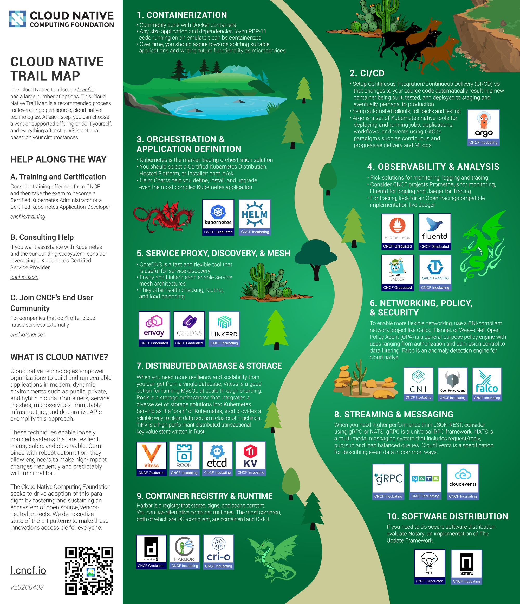
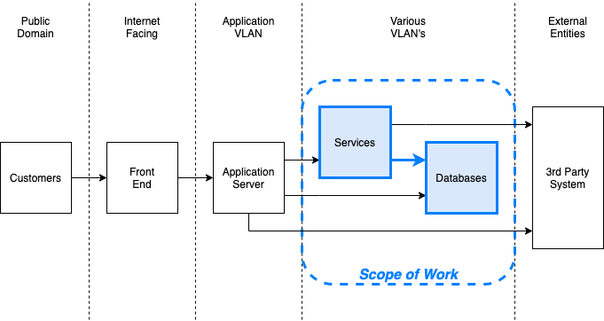
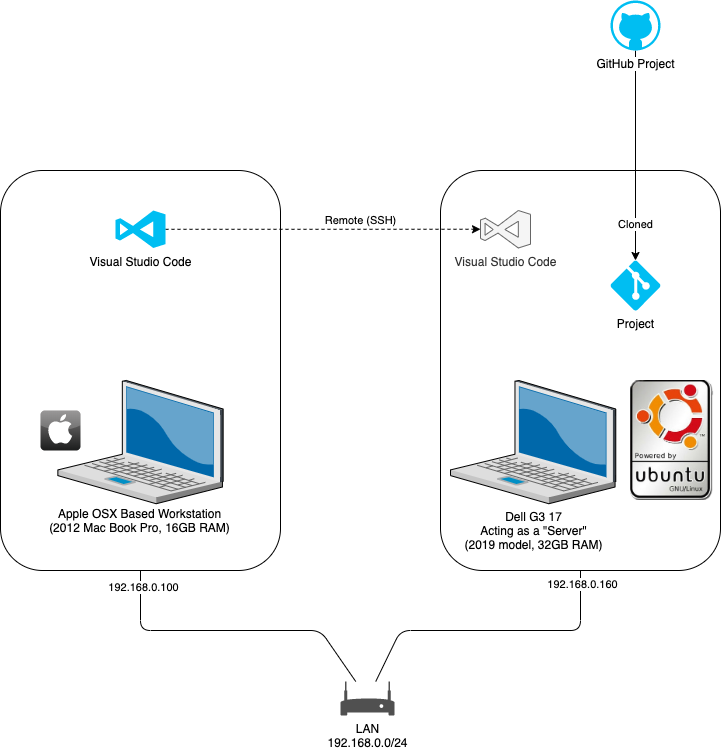

- [1. Introduction & Background](#1-introduction--background)
  - [1.1 Trail Map](#11-trail-map)
  - [1.2 Architecture and Scope of Work](#12-architecture-and-scope-of-work)
- [2. Guiding Principles](#2-guiding-principles)
- [3. Lab Environment](#3-lab-environment)
- [4. Getting Started](#4-getting-started)
  - [4.1 Preparing the Workstation](#41-preparing-the-workstation)
  - [4.2 Preparing the Server](#42-preparing-the-server)
  - [4.3 Network and Security](#43-network-and-security)
  - [4.4 Cloning your repo](#44-cloning-your-repo)
  - [4.5 Prepare your Python environment](#45-prepare-your-python-environment)
- [5. Story Line and Scenarios](#5-story-line-and-scenarios)

# 1. Introduction & Background

This is a project that I started to learn about Modern IT Architectures, DevSecOps, Microservices, Cloud-Native, Kubernetes and other "buzz" words in technology.

The learning experience will be organized in `scenarios`, each with it's own branch. Within each `scenario` branch, will be a `scenario/` directory containing theoretical material around the specific scenario.

All `scenarios` follow a story line: There is this `Cool App`, which happens to be an existing [Python](https://www.python.org/) [Flask](https://flask.palletsprojects.com/en/1.1.x/) App.

The cool app, in it's initial version, can easily be containerized in a Docker container. It is stateful in the sense that state is maintained within the container and therefore it is not possible to scale the application yet. It is done on purpose, so that we have a reference of how the application needs to change as we progress through the `scenarios` in the story line. 

The application versions will be maintained in separate application version branches, and each `scenario` will refer to the various branches as appropriate.

Therefore, the storyline follows the route of modernizing a stateful "monolithic" application in an n-tier architecture to a stateless microservice application that is highly scalable and developed using Cloud-Native principles. Microsoft have a very detailed [definition and introduction](https://docs.microsoft.com/en-us/dotnet/architecture/cloud-native/definition) to what Cloud-Native is and [the Cloud-Native Compute Foundation](https://www.cncf.io/) developed a [trail map](https://github.com/cncf/landscape/blob/master/README.md#trail-map) which turns out to be also our story line :-D

The trail map I will use is included below and was copied from the [Cloud-Native Foundation GitHub Repo](https://github.com/cncf/landscape)'s master branch on 2020-04-30 and is re-used here under [Apache Licence v2](https://github.com/cncf/landscape/blob/master/LICENSE) which was the license at the time of download ([commit d047457 on Mar 1, 2018 ](https://github.com/cncf/landscape/commit/d04745721a2ac257a3c156b26a9ac034fb20cc00)).

## 1.1 Trail Map

([click on the map for a larger version](artwork/cncf_trailmap_latest.png))

<center><a href="artwork/cncf_trailmap_latest.png"></a></center>

## 1.2 Architecture and Scope of Work

The larger application is a web based application deployed in a traditional data center. The `scenarios` in this project is focused only on a sub-set of the larger application. The back story goes something like this: _"The team have been tasked to align to the new IT Modernization strategy the company and as such you need to start the work on the notes service, which your team originally hacked together in a sprint to fill a gap. The job was so rushed, the best name that the team could come up with was the `Cool App`. The business is expecting massive growth and want to move the entire stack to an architecture that is massively scalable. The guidance was to target a Kubernetes type environment and to ensure that all applications are adapted as required to operate and scale within such an environment."_

The overview of the current stack and how the pieces fit together can be viewed in the following diagram:

<center><a href="artwork/scope_of_work.png"></a></center>

Within the `Services` block is the `Cool App` - a note taking service - with it's database (PosgreSQL).

# 2. Guiding Principles

This project will aim to at the very least stick to the spirit of Cloud-Native principles, although there may be different technologies used at times, but these will be discussed in detail in the various `scenarios`.

As highlighted in the before mentioned [Microsoft document](https://docs.microsoft.com/en-us/dotnet/architecture/cloud-native/definition) I will attempt to stick to the [12-factor principles and practices](https://12factor.net/), and each `scenario` will explain how we move closer to alignment with these principles.

As far as humanly possible, I will keep the stack [Open Source](https://opensource.com/resources/what-open-source).

# 3. Lab Environment

I think at this stage it is also a good idea to touch on te lab set-up, not only for reference sake, but also because I am trying out a new set-up with the eye on keeping all my development artifacts in the cloud in future.

The diagram below illustrate my lab setup:

([click on the map for a larger version](artwork/lab-setup.png))

 <center><a href="artwork/lab-setup.png"></a></center>

 For more information on getting Visual Studio Code to work on a remote Git repository, refer to the [documentation](https://code.visualstudio.com/docs/remote/ssh).

 The `Workstation` generally refers to the Mac Book Pro I am actually working on. The `Server` refers to the Dell laptop acting as a server. 

 __Important__: Some of the examples may include hostnames or IP addresses relevant to the original lab environment. You should adjust these to suite your environment. It is entirely possible to run everything on a single system.

 # 4. Getting Started

As a start, I suggest you fork this repo so that you have your own place to play. You can keep up to date by following this GitHub guide:

* [Working with forks](https://help.github.com/en/github/collaborating-with-issues-and-pull-requests/working-with-forks)

Once you have done that, i would suggest the following:

* Use your web browser to view **_this README_** in the master branch in your forked GitHub repo - on GitHub.
* The next action you can do on your cloned repo in your local environment:
  * Checkout the various scenarios and view the [`scenario` README](./scenario/README.md) in another browser tab.
  * If you need to work on the source code in any of the source branches, you can checkout the source branch and do what ever you need to do. As long as you don't navigate away from the README in the browser tab, you should be able to follow all the instructions although that README is technicall no longer "there"

Now, with that out of the way and before checking out the first `scenario`, take some time to set-up your environment.

## 4.1 Preparing the Workstation

On the `Workstation` I have the following installed that I used on this project - and not all is required for following this tutorials and will be marked as optional:

* Your fav web browser (I use mainly [Firefox](https://www.mozilla.org/en-US/exp/firefox/new/))
* Access to a decent terminal (I use [iTerm2](https://www.iterm2.com/))
* [Visual Studio Code](https://code.visualstudio.com/)
  * Follow the [instructions](https://code.visualstudio.com/docs/remote/ssh) to setup your remote vscode session
* On the Mac, I use [Homebrew](https://brew.sh/) that gives me access to all the "missing" tools easy to find on a Linux system.
  * On Windows, you may have access to WSL, which may work for you, but you are really on your own :-)
* I use [Dash](https://kapeli.com/dash) for quick offline reference to documentation.
  * [Zeal](https://zealdocs.org/) seems to be a decent alternative, but I have not used it

In terms of themes, I stick to [Dracula](https://draculatheme.com/) wherever possible. It's very pleasant to the my eyes.

For the long hours you are going to spend in front of your PC, I also recommend a pair of good quality blue light lenses for your glasses. I use [Gunnar PPK](https://gunnar.com/product/ppk-prescription/) glasses.

Below is a list of extensions I have installed on VS Code. They are all optional:

* Docker
* Code Spell Checker
* Kubernetes
* Markdown All in One
* Python
* YAML
* and those installed for SSH remote work
* PostgreSQL

## 4.2 Preparing the Server

On the `Server` I have installed the following in the context of the first scenario:

* [Ubuntu 18.04](https://releases.ubuntu.com/18.04.4/)
* Installed from Ubuntu repo:
  * [Git](https://git-scm.com/doc)
  * [Python 3](https://docs.python.org/3/)
  * [tmux](https://github.com/tmux/tmux/wiki)
  * [Docker](https://docs.docker.com/)
  * [OpenSSH](https://www.openssh.com) client and server

Other tools will be installed as per the different `scenarios`.

## 4.3 Network and Security

I found it is most pleasant to configure your systems with static IP addresses as you will be connecting back and forth a lot.

Apart from that, I highly recommend that you set-up SSH [key based authentication](https://help.ubuntu.com/community/SSH/OpenSSH/Keys) between your workstation and server, should you wish to mimic this lab environment.

You will probably also need SSH keys for many other uses, [such as your GitHub repo](https://help.github.com/en/github/authenticating-to-github/connecting-to-github-with-ssh).

## 4.4 Cloning your repo

Assuming you [have now forked this repo](https://github.com/nicc777/learning-kubernetes-basics), log onto your `Server` and clone your repo:

```
$ mkdir git ; cd git
$ git clone https://github.com/<your-user-name>/learning-kubernetes-basics.git
$ cd learning-kubernetes-basics
$ export TUTORIAL_HOME=$PWD
```

In all scenarios, unless otherwise stated, it is assumed you are working in `$TUTORIAL_HOME`

## 4.5 Prepare your Python environment

I use a [Python Virtual Environment](https://docs.python.org/3/tutorial/venv.html) whenever possible.

To set it up, run the following on your `Server`:

```
$ python3 -m venv venv
$ . venv/bin/activate
(venv) $
```

You can now open the `$TUTORIAL_HOME` in your VS Code IDE, connected to the remote server. It should automatically detect the Python environment if you have the Python extension installed.

# 5. Story Line and Scenarios

The major focus areas are aligned to the 10 areas as described in the Trail and they are:

Containers (Docker)
CI/CD
Orchestration & Application Definition
Observability and Analysis
Service Proxy, Discovery & Mesh
Networking, Policy & Security
Distributed Database & Storage
Streaming & Messaging
Container Registry & Runtime
Software Distribution

In the table below is a brief explanation of the proposed sequence in which you can run the `scenarios`.

| Focus Area | Scenario | Description | Branch | Status |
|------------|----------|-------------|--------|--------|
| Containers (Docker) | Getting Started | Basic orientation of the app and how to get it built using Docker | scenario-000001 | In-Progress, Not-Ready |

__Note__: The table will be updated as I get time to document my learnings.

__Note__: In order to cater for new scenarios that I may want to put in-between existing scenarios, I will leave a gap of about 50 between the initial scenarios. Also, each focus area will have it's own starting digit, starting with 0. Therefore, scenario 1 of Containers will be named branch `scenario-100001` and scenario 2 will be `scenario-100050`. For streaming and messaging, which is the 8th category, the first scenario will be `scenario-800001` and the second `scenario-800050` and so on. 

You can start now with the first scenario by issuing the following command in `$TUTORIAL_HOME`:

```bash
(venv) $ git checkout scenario-100001
```

Once you have done that, open the `scenario` [README](scenario/README.md) in another browser tab. You can also use the Visual Studio Code extension called `Markdown All in One` to open a preview in a tab.


