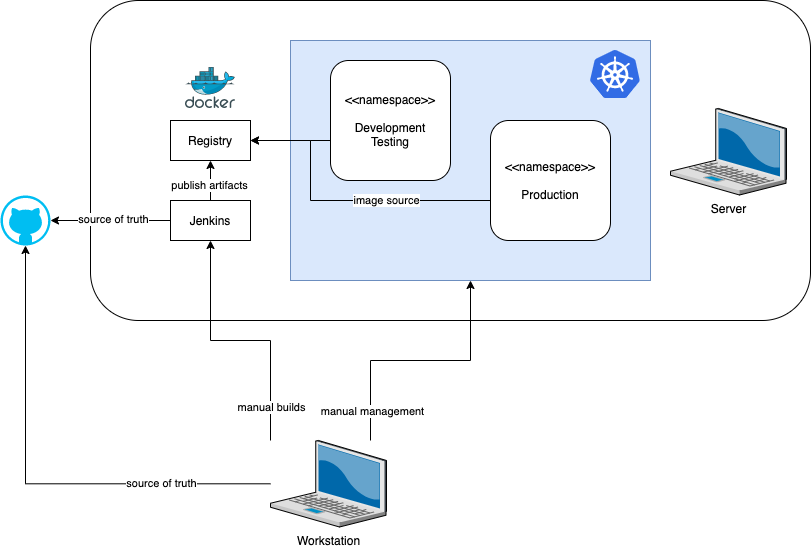
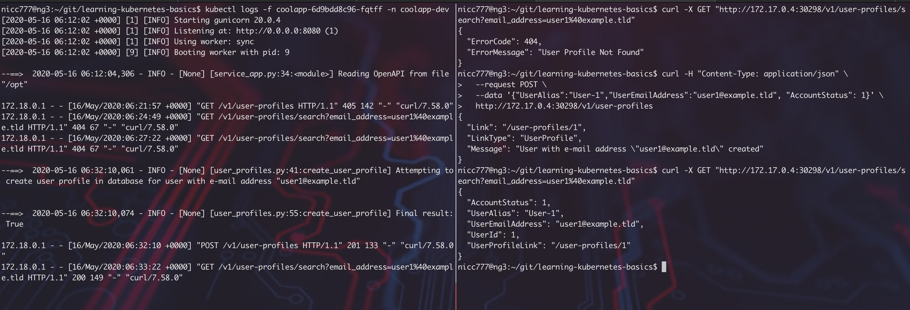

- [1. Objectives of the Scenario](#1-objectives-of-the-scenario)
- [2. Technology & Patterns](#2-technology--patterns)
  - [2.1. The Setup](#21-the-setup)
  - [2.2. Laying the Foundations for GitOps](#22-laying-the-foundations-for-gitops)
- [3. Step-by-Step Demo Walk Through](#3-step-by-step-demo-walk-through)
  - [3.1. Installing Minikube](#31-installing-minikube)
  - [3.2. GitOps Branch](#32-gitops-branch)
  - [3.3. Creating and Using Namespaces](#33-creating-and-using-namespaces)
  - [3.4. Defining Pods and Services](#34-defining-pods-and-services)
    - [3.4.1. Problem when application starts before the database](#341-problem-when-application-starts-before-the-database)
    - [3.4.2 Database requiring an external mount-point with it's associated challenges](#342-database-requiring-an-external-mount-point-with-its-associated-challenges)
  - [3.5. Deployment into Development Namespace](#35-deployment-into-development-namespace)
  - [3.6. Testing in the Development Namespace](#36-testing-in-the-development-namespace)
- [4. Scenario Discussion](#4-scenario-discussion)
  - [4.1 Trail-Map Progress](#41-trail-map-progress)
  - [4.2 Cloud-Native Principles Progress](#42-cloud-native-principles-progress)
- [5. References](#5-references)

# 1. Objectives of the Scenario 

In this scenario, I want to start the application and database in a Kubernetes cluster, where the application is exposed as a Kubernetes service.

There are also a number of foundational tasks, for example the establishment of GitOps principles.

# 2. Technology & Patterns

Apart from focusing on [Kubernetes](https://kubernetes.io/), the actual implementation in the lab environment will be done using [Minikube](https://kubernetes.io/docs/setup/learning-environment/minikube/), which is a learning environment for Kubernetes. Towards the end of this series of scenarios I will look at how to deploy to an actual production Kubernetes cluster, but for now, I will stick with Minikube for the remainder of the scenarios.

Having stated that principle, it is also a good opportunity to experiment with how to run different environments within the cluster. For example, we may want a development-testing environment (where developers can test), a more stable formal testing environment and then a production environment. All these different environments can be achieved in Kubernetes by using [namespaces](https://kubernetes.io/docs/concepts/overview/working-with-objects/namespaces/).

## 2.1. The Setup

([click on the image for a larger version](images/kubernetes_environment.png))

<center><a href="images/kubernetes_environment.png"></a></center>

## 2.2. Laying the Foundations for GitOps

GitOps have been described by several sources, but I found the following two to stand out:

* [Atlassian GitOps Reference](https://www.atlassian.com/git/tutorials/gitops)
* These two articles from WeaveWorks:
  * [What is GitOps](https://www.weave.works/blog/what-is-gitops-really); and
  * [GitOps - Operations by Pull Request](https://www.weave.works/blog/gitops-operations-by-pull-request)

I need to spend some time on the topic as I believe it is especially important and relevant for establishing proper governance in Agile development environments within regulated organizations. After all, all actions must be traceable and linked to individual users with the right authority giving permission - also known as a change management process.

There have been many debates over the years of how to establish proper change management governance within agile teams and I believe GitOps truly satisfy all the requirements:

* There is a defined process
* Users must be authenticated before they can perform actions
* All actions are logged
* Within each step of the process, minimum requirements can be defined and enforced
* The next step will not kick off if the previous step have not been properly signed off as per all the requirements

It is important to note at this point that different Git technologies will give you different features and options in putting together a process that will meet the governance requirements of your particular organization. You also have to take into account your entire eco system, including your project management tools etc.

Here is a short list of some popular options you may need to consider:

* The [Atlassian](https://www.atlassian.com) stack
* [Azure DevOps](https://azure.microsoft.com/en-us/services/devops/), formerly known as [TFS](https://docs.microsoft.com/en-us/azure/devops/server/tfs-is-now-azure-devops-server?view=azure-devops)
  * __Note__: [Microsoft acquired GitHub](https://news.microsoft.com/2018/06/04/microsoft-to-acquire-github-for-7-5-billion/) in 2018, and I think it would be reasonable to assume that the GitHub support withing Azure DevOps will improve over time. Here is some [documentation](https://docs.microsoft.com/en-us/azure/devops/boards/github/?toc=%2Fazure%2Fdevops%2Fboards%2Ftoc.json&bc=%2Fazure%2Fdevops%2Fboards%2Fbreadcrumb%2Ftoc.json&view=azure-devops) on how to integrate Azure DevOps and GitHub.

In all the scenarios, however, I am not focusing on the practice of the various techniques as this will differ from team to team, and I will just be using normal GitHub throughout. 

# 3. Step-by-Step Demo Walk Through

This scenario demonstrates the following:

* Installing Minikube and required tools on the `Server`
* Creating a GitOps branch for our Kubernetes configs
* Defining our environments
* Defining our Pods and Services
* Manual deployment to the development namespace
* Testing in the development namespace

For all examples I am using a terminal session to the `Server` and issue all commands on the `Server`.

## 3.1. Installing Minikube

I am not going to list the detail in this step, but there are some really good resources available on how to install Minikube and get going. Here is a short list of resources you can consider, depending on your environment:

* [How To Install Minikube on Ubuntu 20.04/18.04 & Debian 10 Linux](https://computingforgeeks.com/how-to-install-minikube-on-ubuntu-debian-linux/)
* [Kubernetes Official Installation Guide](https://kubernetes.io/docs/tasks/tools/install-minikube/)

After you are done, you should be able to use the `kubectl` command and see something similar to this:

```bash
$ kubectl version -o json
{
  "clientVersion": {
    "major": "1",
    "minor": "17",
    "gitVersion": "v1.17.4",
    "gitCommit": "8d8aa39598534325ad77120c120a22b3a990b5ea",
    "gitTreeState": "clean",
    "buildDate": "2020-03-12T21:03:42Z",
    "goVersion": "go1.13.8",
    "compiler": "gc",
    "platform": "linux/amd64"
  },
  "serverVersion": {
    "major": "1",
    "minor": "17",
    "gitVersion": "v1.17.0",
    "gitCommit": "70132b0f130acc0bed193d9ba59dd186f0e634cf",
    "gitTreeState": "clean",
    "buildDate": "2019-12-07T21:12:17Z",
    "goVersion": "go1.13.4",
    "compiler": "gc",
    "platform": "linux/amd64"
  }
}

$ kubectl get all
NAME                 TYPE        CLUSTER-IP   EXTERNAL-IP   PORT(S)   AGE
service/kubernetes   ClusterIP   10.96.0.1    <none>        443/TCP   21d

$ kubectl get namespaces
NAME                   STATUS   AGE
default                Active   21d
demo                   Active   14d
kube-node-lease        Active   21d
kube-public            Active   21d
kube-system            Active   21d
kubernetes-dashboard   Active   20d
mystuff                Active   15d
```

__Note__: In the output you may find some differences, depending how you experimented during the particular guide you followed.

## 3.2. GitOps Branch

There may be some changes required as we go through the entire series of scenarios, so in terms of organization, the branching structure will work as follows:

* There is a new branch, from master, called [`kube-ops`](https://github.com/nicc777/learning-kubernetes-basics/tree/kube-ops). 
* From this branch, several other branches will be created depending on the scenario. __Note__: You do not have to work in these branches. They will all be merged back into the main `kube-ops` branch.

The `kube-ops` branch will contain the necessary scripts to ensure you apply the correct configuration to Kubernetes.

## 3.3. Creating and Using Namespaces

The namespaces are defined in the [`kube-ops`](https://github.com/nicc777/learning-kubernetes-basics/tree/kube-ops) branch in the file `state-300001/namespaces.yaml`.

You do not have to do anything special at this point.

## 3.4. Defining Pods and Services

The following files contain the configurations for our entire application stack for deployment in Kubernetes (or Minikube in this case):

| File                        | Description                             |
|-----------------------------|-----------------------------------------|
| `namespaces.yaml`           | The namespaces definition.              |
| `database-dev-pv.yaml`      | The persisted volume definition         |
| `database-dev.yaml`         | The actual database POD.                |
| `database-dev-service.yaml` | The definition for the database service |
| `coolapp-dev.yaml`          | The application definition              |
| `coolapp-dev-service.yaml`  | The application service definition      |

To prepare the local volumes run the following commands:

```bash
$ sudo rm -frR /opt/pod-volumes/database-dev
$ sudo mkdir -p /opt/pod-volumes/database-dev
$ sudo chown -R $USER.$USER /opt/pod-volumes
```
Finally, there are some other considerations at this point:

### 3.4.1. Problem when application starts before the database

In a traditional setting, there would have been enough measures to ensure the database is set-up before the application starts.

In microservices, there are generally no guarantees in which order services starts and you have to design and implement for such scenarios. One useful pattern to employ for these scenarios is the [Circuit Breaker Pattern](https://docs.microsoft.com/en-us/azure/architecture/patterns/circuit-breaker). You can also read what [Martin Fowler](https://martinfowler.com/bliki/CircuitBreaker.html) have to say about this pattern.

This implementation is not yet in our app and we will introduce it later. Therefore, for now, we need to start things manually and in a specific order.

Another option is to use [Pod Priority and Preemption](https://kubernetes.io/docs/concepts/configuration/pod-priority-preemption/), but I think in this specific scenario it would be better to aim for the circuit breaker pattern as this is a very common use case for it.

### 3.4.2 Database requiring an external mount-point with it's associated challenges

We will have to expose a mount-point from the host via NFS as this is where the database files will reside and be persisted.

This does create some unique challenges, one of which is that we need to ensure [only one instance](https://kubernetes.io/docs/tasks/run-application/run-single-instance-stateful-application/) of the database is ever running.

The database configuration will therefore include a NFS mount, but first we need to create a NFS share. You may need to refer to your systems documentation for detailed instructions.

The configuration on the `Server` on my systems looks like this (file: `/etc/exports`):

```text
/opt/pod-volumes/database-dev *(rw,async,no_subtree_check,no_root_squash,insecure)
```

Assuming you may already have minikube running, I will show how to start on a clean slate. Basically the steps will be:

1. Start a fresh Minikube instance (in my case, running as a Docker image)
2. Install the NFS utilities in the Minikube Docker Container in order to mount the exported NFS share

```bash
$ minikube delete
$ minikube start --insecure-registry="192.168.0.160:5000"
😄  minikube v1.10.1 on Ubuntu 18.04
✨  Automatically selected the docker driver
👍  Starting control plane node minikube in cluster minikube
🚜  Pulling base image ...
💾  Downloading Kubernetes v1.18.2 preload ...
    > preloaded-images-k8s-v3-v1.18.2-docker-overlay2-amd64.tar.lz4: 525.43 MiB
🔥  Creating docker container (CPUs=2, Memory=7900MB) ...
🐳  Preparing Kubernetes v1.18.2 on Docker 19.03.2 ...
    ▪ kubeadm.pod-network-cidr=10.244.0.0/16
🔎  Verifying Kubernetes components...
🌟  Enabled addons: default-storageclass, storage-provisioner
🏄  Done! kubectl is now configured to use "minikube"

$ minikube status
minikube
type: Control Plane
host: Running
kubelet: Running
apiserver: Running
kubeconfig: Configured

$ docker container ls
CONTAINER ID        IMAGE                                 COMMAND                  CREATED              STATUS              PORTS                                                                                                      NAMES
adb89b12aaed        gcr.io/k8s-minikube/kicbase:v0.0.10   "/usr/local/bin/entr…"   About a minute ago   Up About a minute   127.0.0.1:32803->22/tcp, 127.0.0.1:32802->2376/tcp, 127.0.0.1:32801->5000/tcp, 127.0.0.1:32800->8443/tcp   minikube
0bb4e346b8a8        registry:2                            "/entrypoint.sh /etc…"   5 days ago           Up 5 days           0.0.0.0:5000->5000/tcp                                                                                     registry
6ad45f581299        jenkins-custom                        "/sbin/tini -- /usr/…"   6 days ago           Up 6 days           0.0.0.0:50000->50000/tcp, 0.0.0.0:8085->8080/tcp                                                           jenkins-coolapp-builder
28cc7d0dbb52        postgres                              "docker-entrypoint.s…"   6 days ago           Up 6 days           0.0.0.0:5332->5432/tcp                                                                                     jenkins-coolapp-db

$ docker exec -it minikube bash
root@minikube:/# apt-get update
   .
   .
   .
root@minikube:/# apt-get install nfs-common -y
   .
   .
   .
root@minikube:/# exit
exit 
```

__Important__: We started minikube with a parameter `--insecure-registry`. In production, we will use properly secured registries, and it should be kept in mind that this is a lab environment. In future scenarios, we will start to address these issues.

References:

* [Persisted Volumes](https://kubernetes.io/docs/concepts/storage/persistent-volumes/)

## 3.5. Deployment into Development Namespace

```bash
$ kubectl apply -f state-300001/namespaces.yaml -n coolapp-dev
namespace/coolapp-dev created
namespace/coolapp-prod created
$ kubectl apply -f state-300001/database-dev-pv.yaml -n coolapp-dev
persistentvolume/db-pv-volume unchanged
persistentvolumeclaim/db-pv-claim created
$ kubectl apply -f state-300001/database-dev.yaml -n coolapp-dev
deployment.apps/coolapp-database created
```

Now, we first need to create the databases.

First, get the connections details of the database:

```bash
$ minikube service coolapp-database --url -n coolapp-dev
http://172.17.0.4:32450
```

And then connect:

```bash
$ psql -h 172.17.0.4 -p 32450 -U postgres postgres
Password for user postgres:
psql (10.12 (Ubuntu 10.12-0ubuntu0.18.04.1), server 12.2 (Debian 12.2-2.pgdg100+1))
WARNING: psql major version 10, server major version 12.
         Some psql features might not work.
Type "help" for help.

postgres=# create database coolapp;
CREATE DATABASE
postgres=# \q
$ psql -h 172.17.0.4 -p 32450 -U postgres coolapp
Password for user postgres:
psql (10.12 (Ubuntu 10.12-0ubuntu0.18.04.1), server 12.2 (Debian 12.2-2.pgdg100+1))
WARNING: psql major version 10, server major version 12.
         Some psql features might not work.
Type "help" for help.

coolapp=# CREATE TABLE public.user_profiles (
coolapp(#     uid bigserial NOT NULL,
coolapp(#     user_alias varchar(64) NOT NULL,
coolapp(#     user_email_address varchar(255) NOT NULL,
coolapp(#     account_status int4 NOT NULL DEFAULT 1,
coolapp(#     CONSTRAINT user_profiles_pk PRIMARY KEY (uid),
coolapp(#     CONSTRAINT user_profiles_un_001 UNIQUE (user_email_address)
coolapp(# );
CREATE TABLE
coolapp=# CREATE TABLE public.notes (
coolapp(#     nid bigserial NOT NULL,
coolapp(#     uid int4 NOT NULL DEFAULT 1,
coolapp(#     note_timestamp int4 NOT NULL,
coolapp(#     note_text text NOT NULL,
coolapp(#     CONSTRAINT notes_pk PRIMARY KEY (nid),
coolapp(#     CONSTRAINT notes_un_01 UNIQUE (uid, note_timestamp),
coolapp(#     CONSTRAINT notes_un_02 UNIQUE (uid, note_text),
coolapp(#     CONSTRAINT notes_fk FOREIGN KEY (uid) REFERENCES user_profiles(uid) ON UPDATE RESTRICT ON DELETE RESTRICT
coolapp(# );
CREATE TABLE
coolapp=# \d
                  List of relations
 Schema |         Name          |   Type   |  Owner
--------+-----------------------+----------+----------
 public | notes                 | table    | postgres
 public | notes_nid_seq         | sequence | postgres
 public | user_profiles         | table    | postgres
 public | user_profiles_uid_seq | sequence | postgres
(4 rows)
```

You can refer to [branch `appsrc-0.0.2`](https://github.com/nicc777/learning-kubernetes-basics/tree/appsrc-0.0.2/app-src/sql) for the relevant DDL scrips.

Next, start the application POD and service:

```bash
$ kubectl apply -f state-300001/coolapp-dev.yaml -n coolapp-dev
deployment.apps/coolapp created
$ kubectl apply -f state-300001/coolapp-dev-service.yaml -n coolapp-dev
service/coolapp-app created
$ kubectl get all -n coolapp-dev
NAME                                    READY   STATUS    RESTARTS   AGE
pod/coolapp-6d9bdd8c96-fqtff            1/1     Running   0          4m49s
pod/coolapp-database-768954fdc4-5t75s   1/1     Running   0          15h

NAME                       TYPE       CLUSTER-IP     EXTERNAL-IP   PORT(S)          AGE
service/coolapp-app        NodePort   10.100.21.13   <none>        8080:30298/TCP   54s
service/coolapp-database   NodePort   10.96.165.5    <none>        5432:32450/TCP   14h

NAME                               READY   UP-TO-DATE   AVAILABLE   AGE
deployment.apps/coolapp            1/1     1            1           4m49s
deployment.apps/coolapp-database   1/1     1            1           15h

NAME                                          DESIRED   CURRENT   READY   AGE
replicaset.apps/coolapp-6d9bdd8c96            1         1         1       4m49s
replicaset.apps/coolapp-database-768954fdc4   1         1         1       15h
```

To check if the application started successfully:

```bash
$ kubectl logs coolapp-6d9bdd8c96-fqtff -n coolapp-dev
[2020-05-16 06:12:02 +0000] [1] [INFO] Starting gunicorn 20.0.4
[2020-05-16 06:12:02 +0000] [1] [INFO] Listening at: http://0.0.0.0:8080 (1)
[2020-05-16 06:12:02 +0000] [1] [INFO] Using worker: sync
[2020-05-16 06:12:02 +0000] [9] [INFO] Booting worker with pid: 9

--==>  2020-05-16 06:12:04,306 - INFO - [None] [service_app.py:34:<module>] Reading OpenAPI from file "/opt"
```

## 3.6. Testing in the Development Namespace

Get the service end-point:

```bash
$ minikube service coolapp-app --url -n coolapp-dev
http://172.17.0.4:30298
```

And run a basic test:

```bash
$ curl -X GET "http://172.17.0.4:30298/v1/user-profiles/search?email_address=user1%40example.tld"
{
  "ErrorCode": 404,
  "ErrorMessage": "User Profile Not Found"
}
```

Let's create a user:

```bash
$ curl -H "Content-Type: application/json" \
  --request POST \
  --data '{"UserAlias":"User-1","UserEmailAddress":"user1@example.tld", "AccountStatus": 1}' \
  http://172.17.0.4:30298/v1/user-profiles
{
  "Link": "/user-profiles/1",
  "LinkType": "UserProfile",
  "Message": "User with e-mail address \"user1@example.tld\" created"
}
$ curl -X GET "http://172.17.0.4:30298/v1/user-profiles/search?email_address=user1%40example.tld"
{
  "AccountStatus": 1,
  "UserAlias": "User-1",
  "UserEmailAddress": "user1@example.tld",
  "UserId": 1,
  "UserProfileLink": "/user-profiles/1"
}
```

Below is a screenshot to demonstrate how you could use `tmux` or similar utilities to check the logs while you are testing. You want to make sure the application log doesn't show any errors.

([click on the map for a larger version](artwork/cncf_trailmap_latest.png))

<center><a href="images/tmux_session.png"></a></center>

# 4. Scenario Discussion

TODO

__Code changes and Upgrades in the Development Namespace__

TODO

__Development Blue/Green Deployments__

TODO

In each scenario we will map our progress against the Cloud-Native Trail Map and against the Cloud-Native Principles.

## 4.1 Trail-Map Progress

| Category                               | Technologies & Patterns Used | Progress and other notes |
|----------------------------------------|------------------------------|--------------------------|
| Containers (Docker)                    | n/a                          | not started yet          |
| CI/CD                                  | n/a                          | not started yet          |
| Orchestration & Application Definition | n/a                          | not started yet          |
| Observability and Analysis             | n/a                          | not started yet          |
| Service Proxy, Discovery & Mesh        | n/a                          | not started yet          |
| Networking, Policy & Security          | n/a                          | not started yet          |
| Distributed Database & Storage         | n/a                          | not started yet          |
| Streaming & Messaging                  | n/a                          | not started yet          |
| Container Registry & Runtime           | n/a                          | not started yet          |
| Software Distribution                  | n/a                          | not started yet          |

## 4.2 Cloud-Native Principles Progress

| Factor                        | Progress and Discussion |
|-------------------------------|-------------------------|
| Code Base                     | No progress yet         |
| Dependencies                  | No progress yet         |
| Configurations                | No progress yet         |
| Backing Services              | No progress yet         |
| Build, Release, Run           | No progress yet         |
| Processes                     | No progress yet         |
| Port Binding                  | No progress yet         |
| Concurrency                   | No progress yet         |
| Disposability                 | No progress yet         |
| Dev/Prod Parity               | No progress yet         |
| Logging                       | No progress yet         |
| Admin Processes               | No progress yet         |
| API First                     | No progress yet         |
| Telemetry                     | No progress yet         |
| Authentication/ Authorization | No progress yet         |

# 5. References

* [GitHub Flow](https://guides.github.com/introduction/flow/)
* [Kubernetes Namespaces](https://kubernetes.io/docs/concepts/overview/working-with-objects/namespaces/)
  * [Various tasks in Namespaces](https://kubernetes.io/docs/tasks/administer-cluster/namespaces/)
* [kustomize](https://github.com/kubernetes-sigs/kustomize)
  * [Kubernetes: Merge Multiple YAML Files Into One](https://levelup.gitconnected.com/kubernetes-merge-multiple-yaml-into-one-e8844479a73a)
  * [Kubernetes: Change base YAML config for different environments prod/test using Kustomize](https://levelup.gitconnected.com/kubernetes-change-base-yaml-config-for-different-environments-prod-test-6224bfb6cdd6)


