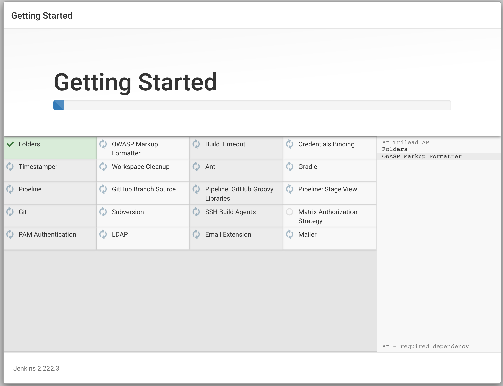

- [1. Objectives of the Scenario](#1-objectives-of-the-scenario)
- [2. Technology & Patterns](#2-technology--patterns)
- [3. Step-by-Step Demo Walk Through](#3-step-by-step-demo-walk-through)
  - [3.1 Prepare a docker environment](#31-prepare-a-docker-environment)
  - [3.2 Start the Jenkins Server](#32-start-the-jenkins-server)
- [4. Scenario Discussion](#4-scenario-discussion)
  - [4.1 Trail-Map Progress](#41-trail-map-progress)
  - [4.2 Cloud-Native Principles Progress](#42-cloud-native-principles-progress)
- [5. References](#5-references)

# 1. Objectives of the Scenario

In this scenario a release branch will be set-up with monitoring/triggers for changes in the release branch.

Essentially whenever there is an approved pull request (PR) into the release branch, the automation needs to kick in.

What needs to be build is the following:

1. If the Base Docker image have changed, build a new base
2. Run the application build script that will also produce a new application image

# 2. Technology & Patterns

For this scenario a build server is required and since [Jenkins](https://www.jenkins.io) is still widely used, I will stick to this trusty old workhorse.

# 3. Step-by-Step Demo Walk Through

These steps are executed on a system where you will host your CI/CD pipeline. For me that is on my `Server` and the commands shown are executed from that server.

I will deploy the official [Docker version of Jenkins](https://hub.docker.com/_/jenkins/).

## 3.1 Prepare a docker environment

In order to run Jenkins in Docker, a number of steps need to be taken since we want to build docker images from Jenkins, which itself will be running in Docker.

Following the guidance from the official Jenkins documentation, you can relatively safely run the following:

```bash
(venv) $ docker network create jenkins
(venv) $ docker volume create jenkins-docker-certs
(venv) $ docker volume create jenkins-data
(venv) $ docker volume inspect jenkins-data
[
    {
        "CreatedAt": "2020-05-03T12:01:18+02:00",
        "Driver": "local",
        "Labels": {},
        "Mountpoint": "/var/lib/docker/volumes/jenkins-data/_data",
        "Name": "jenkins-data",
        "Options": {},
        "Scope": "local"
    }
]
```

The following is the required bit to enable Jenkins to build docker images:

```bash
docker container run \
  --name jenkins-docker \
  --rm \
  --detach \
  --privileged \
  --network jenkins \
  --network-alias docker \
  --env DOCKER_TLS_CERTDIR=/certs \
  --volume jenkins-docker-certs:/certs/client \
  --volume jenkins-data:/var/jenkins_home \
  --publish 2376:2376 \
  docker:dind
```

Check the logs and wait until you see the following:

```bash
(venv) $ docker logs -f jenkins-docker
   <lot of output>
   .
   .
time="2020-05-03T14:07:47.735011769Z" level=info msg="Loading containers: done."
time="2020-05-03T14:07:47.764854743Z" level=info msg="Docker daemon" commit=afacb8b7f0 graphdriver(s)=overlay2 version=19.03.8
time="2020-05-03T14:07:47.764990792Z" level=info msg="Daemon has completed initialization"
time="2020-05-03T14:07:47.796493439Z" level=info msg="API listen on [::]:2376"
time="2020-05-03T14:07:47.796699334Z" level=info msg="API listen on /var/run/docker.sock"
/certs/server/cert.pem: OK
/certs/client/cert.pem: OK
```

## 3.2 Start the Jenkins Server

Start the Jenkins server and give it some time do properly initialize. 

```bash
(venv) $ docker container run \
--name jenkins-blueocean \
--rm -d \
--network jenkins \
-e DOCKER_HOST=tcp://docker:2376 \
-e DOCKER_CERT_PATH=/certs/client \
-e DOCKER_TLS_VERIFY=1 \
-p 0.0.0.0:8085:8080 \
-p 0.0.0.0:50000:50000 \
-v jenkins-data:/var/jenkins_home \
-v jenkins-docker-certs:/certs/client:ro \
jenkinsci/blueocean
8c06ace0b23a3dea3db329cf7cc4e3e405946a40edc93b415dbe66ca99ab42e9
(venv) $ docker logs -f jenkins-blueocean
   <lot of output>
   .
   .
*************************************************************
*************************************************************
*************************************************************

Jenkins initial setup is required. An admin user has been created and a password generated.
Please use the following password to proceed to installation:

ee7a0fbc728b4d258c838d38cda77c95

This may also be found at: /var/jenkins_home/secrets/initialAdminPassword

*************************************************************
*************************************************************
*************************************************************
```

__Important__: Take note of the `password` in the log message.

You can now open [the jenkins page](http://192.168.0.160:8085/) on your `Workstation`.

I started with the community common plug-set set, which turned out to be the following (it may change over time):

<center><a href="screenshot001.png"></a></center>

# 4. Scenario Discussion

TODO

In each scenario we will map our progress against the Cloud-Native Trail Map and against the Cloud-Native Principles.

## 4.1 Trail-Map Progress

| Category                               | Technologies & Patterns Used | Progress and other notes |
|----------------------------------------|------------------------------|--------------------------|
| Containers (Docker)                    | n/a                          | not started yet          |
| CI/CD                                  | n/a                          | not started yet          |
| Orchestration & Application Definition | n/a                          | not started yet          |
| Observability and Analysis             | n/a                          | not started yet          |
| Service Proxy, Discovery & Mesh        | n/a                          | not started yet          |
| Networking, Policy & Security          | n/a                          | not started yet          |
| Distributed Database & Storage         | n/a                          | not started yet          |
| Streaming & Messaging                  | n/a                          | not started yet          |
| Container Registry & Runtime           | n/a                          | not started yet          |
| Software Distribution                  | n/a                          | not started yet          |

## 4.2 Cloud-Native Principles Progress

| Factor                        | Progress and Discussion |
|-------------------------------|-------------------------|
| Code Base                     | No progress yet         |
| Dependencies                  | No progress yet         |
| Configurations                | No progress yet         |
| Backing Services              | No progress yet         |
| Build, Release, Run           | No progress yet         |
| Processes                     | No progress yet         |
| Port Binding                  | No progress yet         |
| Concurrency                   | No progress yet         |
| Disposability                 | No progress yet         |
| Dev/Prod Parity               | No progress yet         |
| Logging                       | No progress yet         |
| Admin Processes               | No progress yet         |
| API First                     | No progress yet         |
| Telemetry                     | No progress yet         |
| Authentication/ Authorization | No progress yet         |

# 5. References

* [Downloading and running Jenkins in Docker](https://www.jenkins.io/doc/book/installing/#downloading-and-running-jenkins-in-docker)

